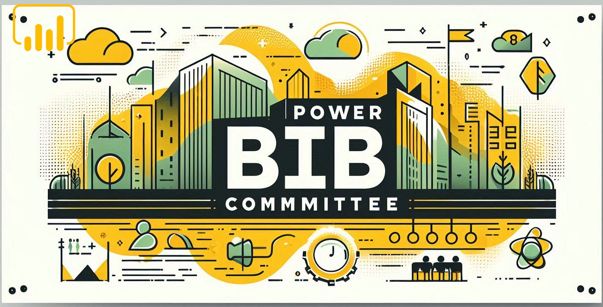
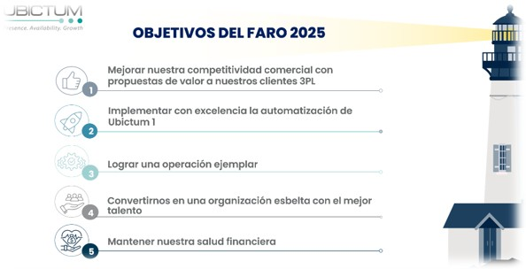

# **Comite de Power BI**

____

### 📌 ***Importancia de Power BI en la empresa***  
Power BI es una herramienta clave. Su uso permite:  

1. **Centralización de la información**: Integra datos de múltiples fuentes en un solo lugar.  
2. **Análisis en tiempo real**: Facilita la visualización y exploración de datos en dashboards interactivos.  
3. **Automatización de reportes**: Reduce el tiempo dedicado a la generación de informes manuales.  
4. **Toma de decisiones basada en datos** 
5. **Facilidad de uso y accesibilidad**

____

### 📌 ***Propósito del Comité de Power BI***  
El comité tendrá como objetivo impulsar el uso de Power BI dentro de la compañía mediante:  

- **Establecer buenas prácticas** en la gestión y visualización de datos.  
- **Definir estándares de reportes** para garantizar la coherencia y calidad de la información.  
- **Capacitar a los empleados** para mejorar sus habilidades en Power BI.  
- **Optimizar procesos** mediante automatización y análisis avanzados.  
- **Fomentar la cultura del dato** para mejorar la toma de decisiones en todas las áreas.  

___

### 📌 ***Comite:***

|Nombre | Puesto| Area  |
| :--- | :---: | ---: |
| 🤖 Daniel Rojas Sánchez | Analista Sr Mejora Continua| Mejora Continua  |
|Erick Esteban Guzmán | Analista Mejora Continua| Mejora Continua  |
|Rangel Figueroa Samantha Rocio | Líder De Talento Y Cultura|Talento Y Cultura|
|Márquez Espino Medardo | Gerente Jr Rrrp| Gerencia Rrrp 3Pl Y Vas  |

___

### 📌 ***Selección de temas para contrucción de tablero***

- **Primer filtro:** Los tableros a construir deberán estar relacionados con algun objetivo del faro
- **El tiempo de construcción:**
    - Disponibilidad de datos
    - Dificultad del desarrollo del modelo de datos

### 📌 Lista de tableros construidos

- [x] Tablero Talento y Cultura
- [x] Tablero DAS
- [x] Tablero 3PL
- [x] Tablero Nivel de Servico Integral
- [x] Tablero Costo y Viajes Transporte
- [x] Tablero de Capacidades
- [x] Tablero Alertas de Procesos y SHEyMA
- [x] Tablero Produbot
- [x] Tablero Incentivos

## 

